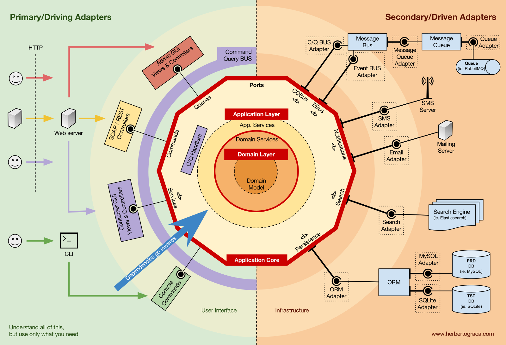

# Architecture and Design Concerns

As much as possible we would like to extract the most poignant aspects from Domain Driven Design and OOP Patterns (
see [Implementing Domain Driven Design](./Implementing_Domain_Driven_Design.md) but then mix with Functional Programming
concepts and Event Sourcing.

[Turning Databases Inside Out](https://martin.kleppmann.com/2015/03/04/turning-the-database-inside-out.html)
"Think of a database as an always-growing collection of immutable facts"  

## ES Modules

[ES Modules a Cartoon Deep Dive](https://hacks.mozilla.org/2018/03/es-modules-a-cartoon-deep-dive/)

The ES Modules spec defines how an implementation should read parse files into module records and how you should
instantiate and evalute that Module.  However it says nothing about hot to get the file in the first place.

The job of getting the file is part of the loader.

    ParseModule
    Module.Instantiate
    Model.Evaluate

In a browser you can tell the loader how to find a file by using the script tag.

    <script src="main.js" type="module"/>


[Node.js v16.16.0 documentation](https://nodejs.org/dist/latest-v16.x/docs/api/esm.html#modules-ecmascript-modules)\
[Mozilla MDN JavaScript Modules](https://developer.mozilla.org/en-US/docs/Web/JavaScript/Guide/Modules)\

Consumers...

```javascript

    import foo from '...foo.js' // extract one item
    import {foo, bar} from '...foo.js'   // extract two items
    import { foo as bar } from `...foo.js` // Renaming
    import * as Foo from '...foo.js'  // Module Object
    import { Foo } from '...foo.js'   // Class
    

```

## Code Organization, Layers and Packaging

[DDD, Hexagonal, Onion, Clean, CQRS, … How I put it all together](https://herbertograca.com/2017/11/16/explicit-architecture-01-ddd-hexagonal-onion-clean-cqrs-how-i-put-it-all-together/)\


[Best Practices for Nodejs Development](https://scoutapm.com/blog/nodejs-architecture-and-12-best-practices-for-nodejs-development)

Package by Layer is Horizontal Slicing.  Consider packaging by Component to provide Vertical Slicing.

[Package by Component](http://www.codingthearchitecture.com/2015/03/08/package_by_component_and_architecturally_aligned_testing.html)

[Google Javascript Style Guide](https://google.github.io/styleguide/jsguide.html)\
[AirBnB JavaScript Style Guide](https://github.com/airbnb/javascript)

[Domain Driven Design for Javascript Developers](https://medium.com/spotlight-on-javascript/domain-driven-design-for-javascript-developers-9fc3f681931a)

## JSON Schema

We'll use JSON Schema to validate data structures such as Value Objects.

## Functional Programming

Since Javascript permits it, we should leverage Functional Programming techniques as much as possible.  At a minimum we
should implement as much functionality as possible in pure functions.

## Immutability

Value Objects will be immutable according to DDD, however we will strive to have everything on the inside of the outer
IO boundary use immutable data and pure functions.

## TDD / Testing Framework/s

[Jest](https://jestjs.io/docs/getting-started) is good for browser side react apps.
[Mocha](https://mochajs.org/) with [Chai](https://www.chaijs.com/) are good for Node.js apps.

## Javascript Modules

[ECMA Script Modules](https://nodejs.org/dist/latest-v16.x/docs/api/esm.html#modules-ecmascript-modules)


## Scratchy References

[Bootstrap](https://getbootstrap.com/docs/5.2/getting-started/introduction/)\
[Bootstrap npm starter](https://github.com/twbs/bootstrap-npm-starter)\
[IBM / RedHat Node.js Reference Architecture](https://github.com/nodeshift/nodejs-reference-architecture)\
[Asynchronous Javascript: From Promises to Async/Await](https://scoutapm.com/blog/async-javascript)
